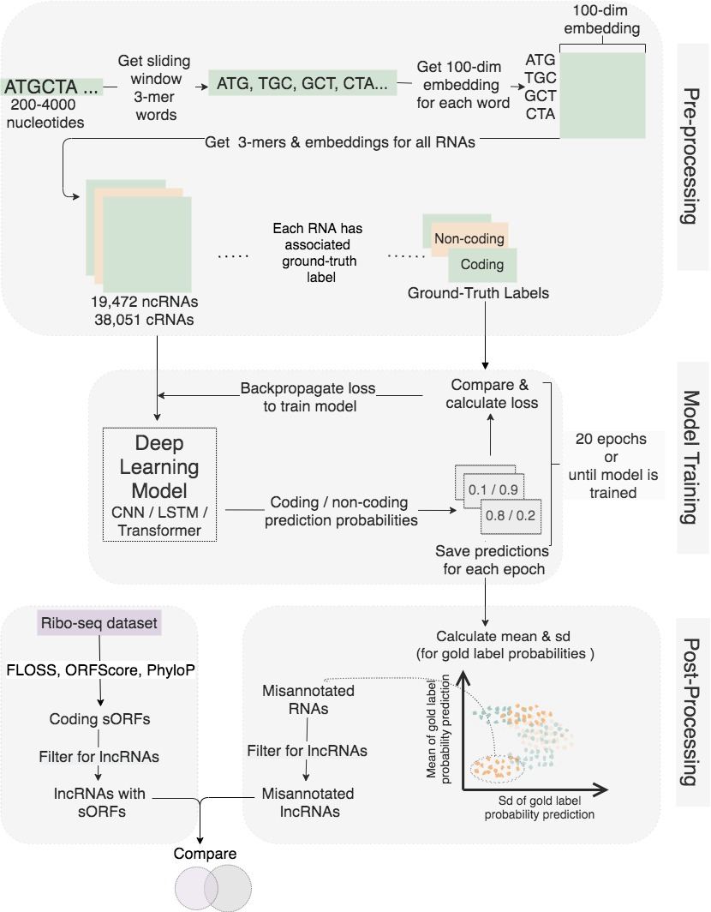

# DetectingMisannotatedLncRNAs
Detecting Misannotated Long Non-coding RNAs using Deep Learning

[BioArxiv Pre-print available here!](https://www.biorxiv.org/content/10.1101/2020.11.07.372771v1)

Long non-coding RNAs (lncRNAs) are the largest class of non-coding RNAs (ncRNAs). However, recent experimental evidence has shown that some lncRNAs contain small open reading frames (sORFs) that are translated into functional micropeptides. Current methods to detect misannotated lncRNAs rely on ribosome-profiling (ribo-seq) experiments, which are expensive and cell-type dependent. In addition, while very accurate machine learning models have been trained to distinguish between coding and non-coding sequences, little attention has been paid to the increasing evidence about the incorrect ground-truth labels of some lncRNAs in the underlying training datasets. We present a framework that leverages deep learning models’ training dynamics to determine whether a given lncRNA transcript is misannotated. Our models achieve AUC scores > 91% and AUPR > 93% in classifying non-coding vs. coding sequences while allowing us to identify possible misannotated lncRNAs present in the dataset. Our results overlap significantly with a set of experimentally validated misannotated lncRNAs as well as with coding sORFs within lncRNAs found by a ribo-seq dataset. The general framework applied here offers promising potential for use in curating datasets used for training coding potential predictors and assisting experimental efforts in characterizing the hidden proteome encoded by misannotated lncRNAs.

